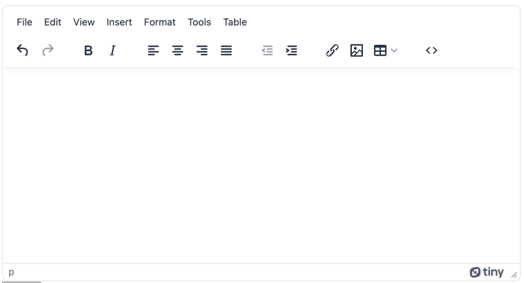

# AWS SES-GO ✉️

## 프로젝트 소개

이메일 템플릿 작성부터 분산 발송 및 결과 관리 등을 손쉽게 할 수 있는 서비스

## 기술 스택

- Go
- Sqlite3
- GoFiber
- AWS SES(이메일 발송)
- AWS SNS(발송 결과 조회)
- handsontable(발송 대상 관리)
- Google OAuth2(구글 로그인)

## 사용 기술

- 단계별로 컨슈밍하는 구조를 적용하여 오류 발생 시 쉽게 재시도 가능
- AWS SES의 초당 발송 제한을 고려한 분산 발송
- 서버가 분리되어 있어도 중복 발송되지 않도록 구조화
- 이메일 열람 이벤트를 확인할 수 있는 로직 추가
- 메세지 상태를 세분화하여 발송 결과를 상세히 확인 가능

## 서비스 구조

| 발송 준비     | 발송 전            | 발송 중          | 발송 직후          | 발송 결과          |
|-----------|-----------------|---------------|----------------|----------------|
| 템플릿 등록/수정 | 발송 계획 조회        | 메세지 컨슈밍       | 메세지 컨슈밍        | 전송 상태별 조회      |
| 발송 대상 등록  | 발송 대상 조회        | "발송중"으로 상태 변경 | "발송 완료"로 상태 변경 | 메세지 열람 여부 조회   |
| 발송 계획 등록  | 발송 대상 개별 메세지 등록 | 발송 요청 결과 조회   | -              | 내부 링크 클릭 여부 조회 |
| -         | 발송 컨슈머로 메세지 전달  | -             | -              | -              |

## 세부 사항

### 사용자 관리

- 구글 로그인을 통해 관리자를 등록
- 관리자는 템플릿, 발송 대상, 발송 계획을 등록할 수 있음
- 관리자는 발송 결과를 조회할 수 있음

### 템플릿

- `tinymce` 오픈소스 에디터를 활용해 비개발자도 쉽게 템플릿 생성할 수 있도록 반영
- 템플릿은 `html` 형식으로 저장되며, `{{변수명}}` 형태로 변수를 사용할 수 있음



### 발송 대상

- 템플릿을 지정하면 해당 템플릿의 변수에 대한 컬럼이 자동 추가
- 발송 대상은 `handsontable` 오픈소스를 활용해 쉽게 관리
- 오픈소스 테이블로 설정된 데이터를 데이터베이스에 저장하고 조회해서 발송

### 발송 계획

- 템플릿과 발송 대상을 선정하고 발송 시간을 지정(즉시 발송 시 미지정)하여 발송 계획을 등록

### 발송 전

- n초 간격으로 현재 시간 기준 발송되어야할 발송 계획이 있는지 조회
- 발송 계획이 있으면 데이터베이스 발송 대상을 조회
- 조회된 발송 대상에 대한 개별 메세지 객체를 생성하여 데이터베이스에 저장
- 생성된 객체를 채널을 이용해서 실제 발송하는 컨슈머로 전달

### 발송 중

- AWS SES의 초당 발송 제한을 고려하여 여러개의 고루틴으로 분산해서 발송
- 컨슈머는 생성된 개별 메세지 객체를 받아 메일 발송
- 발송 결과를 저장하는 컨슈머로 메세지 전달(직접 저장하지 않는 이유는 발송은 여러개의 고루틴으로 분산해서 처리하고 결과 저장은 하나의 고루틴에서 취합해서 처리)

### 발송 후

- 초당 발송 수를 로깅으로 확인 가능
- 발송 결과를 저장하는 컨슈머에서 객체를 받아 상태를 변경

### 발송 결과

- AWS SES 결과를 SNS로 받아 Https로 직접 만든 API에서 받아서 저장

## 이메일 발송 방법

1. AWS SES 등록 및 IAM 계정 생성, TinyMCE API Key 발급 등 사전 준비

2. 환경 변수 설정(`.env`)

```shell
# .env
# 서버 기본 설정
SERVER_HOST=

# AWS 설정
AWS_ACCESS_KEY_ID=
AWS_SECRET_ACCESS_KEY=
EMAIL_SENDER=

# 구글 OAuth2 설정
GOOGLE_CLIENT_ID=
GOOGLE_CLIENT_SECRET=
GOOGLE_REDIRECT_URL=

# TinyMCE API Key
TINYMCE_API_KEY=
```

3. 서버 실행

```shell
$ go mod tidy
$ go build -o ses-go
$ ./ses-go
```

4. 웹 페이지 접속

- `http://localhost:3000`

5. 구글 로그인

6. [Create New Plan] 선택

7. 템플릿 등록 및 선택

8. [use] 또는 [edit] 으로 템플릿 지정

9. 발송 계획 제목 입력

10. 표에 발송 대상 입력

11. 대상 작성 후 [save] 클릭

12. [Create Plan] 클릭

## 향후 계획

- 세분화된 발송 결과를 볼 수 있는 대시보드 제공
- 관리자의 세부 권한 설정
